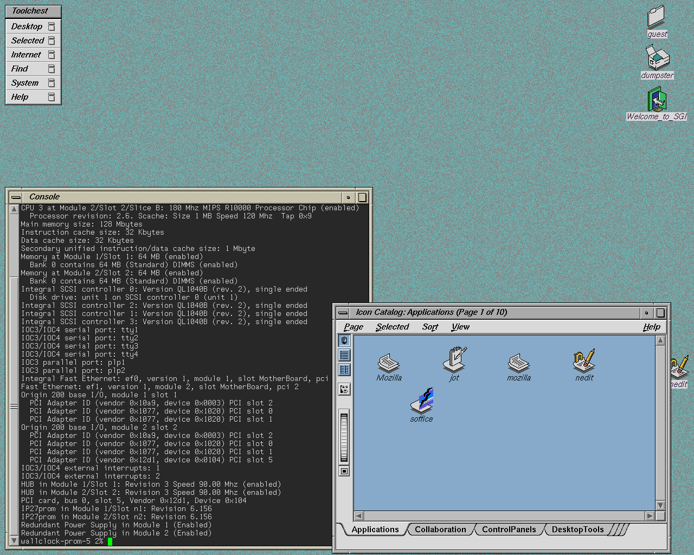
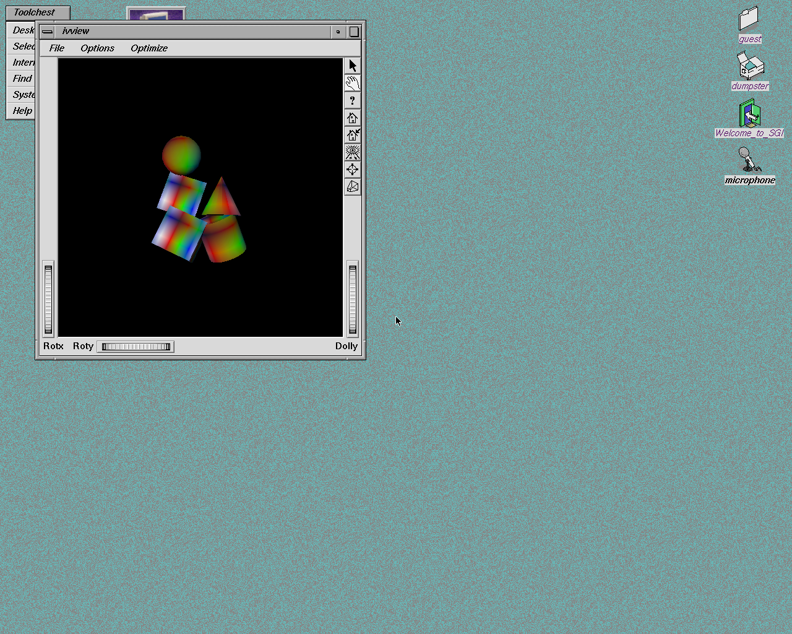

# Origami

An experimental SGI emulator built on QEMU. Vibe coded paper silicon.

Inspired by [Iris](https://github.com/techomancer/iris), and nostalgia for the
systems I cut my teeth on as a young fella. This became an adventure in burning
tokens. Somehow, IRIX boots.

[A website also stuck in the late ’90s](https://origami.irix.fans) ·
[User guide](docs/usage.md) ·
[Contributing](.github/CONTRIBUTING.md)

*Origin 200, two nodes, four CPUs. A moderately expensive way to run `hinv`.*

*Origin 2000 with SI graphics. Some polygons escaped the serial console.*

Development captures from different QEMU revisions.
[Capture details](docs/images/README.md).

## Machines

- **SN0:** Origin 200, Origin 2000, Onyx2.
- **SN1:** Origin 300; Fuel is a work in progress.
- **Other:** Octane / Octane2 are a work in progress.

## What's in here

The Rust `origami` CLI manages machines, disks, consoles and network installs.
QEMU does the emulation. [Instigator](https://github.com/jamesbraid/instigator)
serves the installation media.

| Hardware | Emulated bits |
|---|---|
| Configurations | Deskside, rack and GIGAchannel; SMP, multiple nodes and NUMA |
| CPUs | R10000 and R14000 |
| Graphics | PsiTech RAD1 / RAD4, IMPACT / SI (MGRAS), InfiniteReality (Kona), VPro (Odyssey) |
| Interconnect | Hub, Bedrock, Crossbow, Bridge, XBridge, routers and CrayLink |
| I/O boards | BaseIO, BaseIO-G / MediaIO, IO-8, MENET, MSCSI, PCI carriers and shoehorns |
| Storage | QLogic ISP1040 / ISP12160 SCSI controllers, disks, CD-ROMs and tapes |
| Networking | IOC3 Ethernet, Tigon, BCM570x and Neterion Xframe adapters |
| Peripherals | Serial ports, PS/2 keyboard and mouse, OHCI USB, RAD1 audio |
| Housekeeping | ELSC, module management, L1, flash, EEPROMs and clocks |

The CLI has fewer presets than QEMU has configurations. The
[user guide](docs/usage.md) covers those, and the
[QEMU machine reference](https://github.com/jamesbraid/qemu/blob/2b1e1cc01a57330601d9bbf428fe715e0cbc5f95/docs/specs/sgi-sn.rst) covers the rest.

Implemented does not mean finished. Some combinations boot to a desktop.
Others are an opportunity to stare at a serial console. This is a hobby
experiment. Expect broken things and frequent changes.

## Trying it

Preview builds target Linux x86-64, Windows x86-64 and macOS arm64.
You'll need your own firmware and guest installation media. They aren't bundled.
Start with `origami machines` and the [user guide](docs/usage.md).

## License

[BSD-3-Clause](LICENSE) for the frontend and build tooling. QEMU and bundled
dependencies retain their own licenses.
